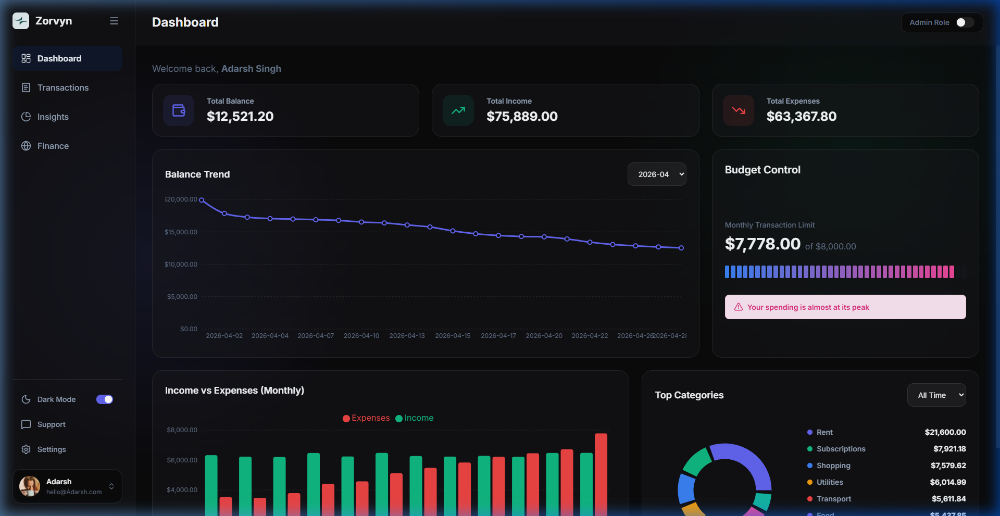
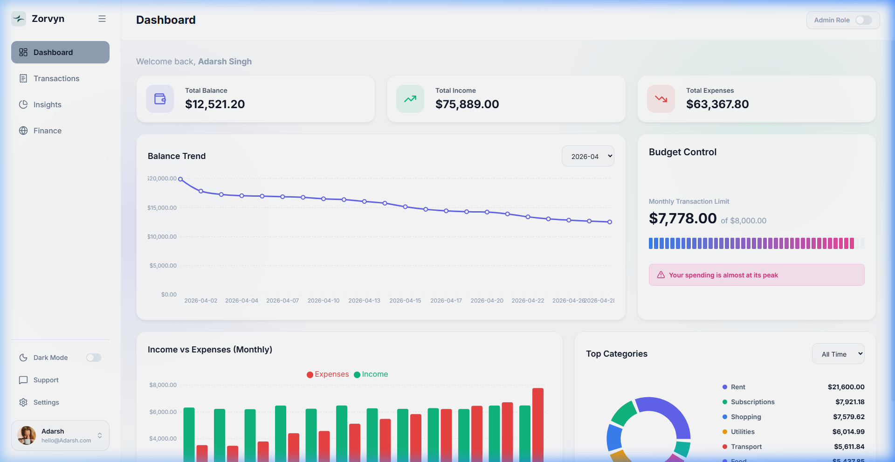
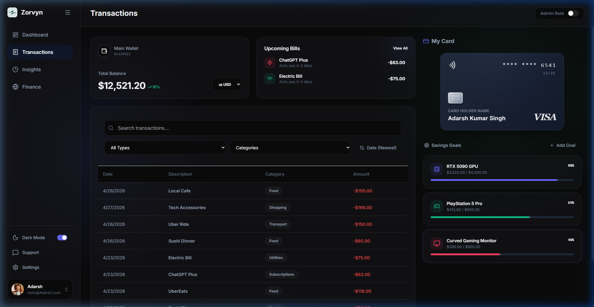
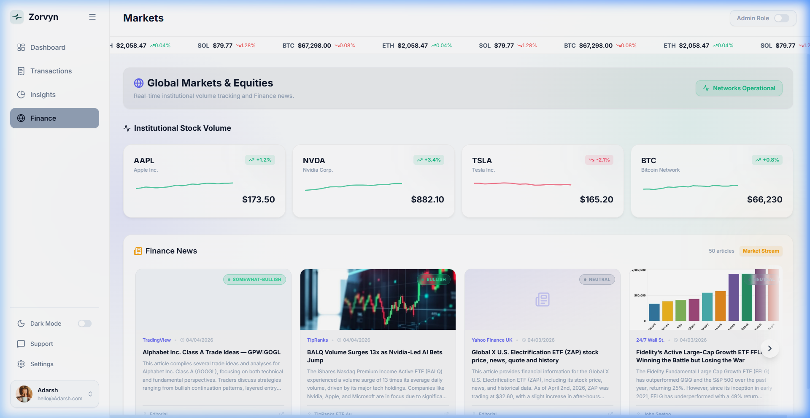
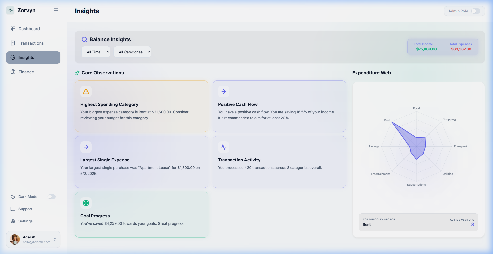

<div align="center">

# ⚡ Zorvyn

### Personal Finance Dashboard

A sleek, modern finance dashboard built with React 19 — track spending, manage budgets, monitor live crypto markets, and gain AI-powered insights into your financial habits.

[](https://react.dev)
[](https://vitejs.dev)
[](https://tailwindcss.com)
[](LICENSE)

<br/>



<br/>

**[Live Demo](https://zorvyn.vercel.app/) · [Report Bug](https://github.com/adaharshsingh/Zorvyn/issues) · [Request Feature](https://github.com/adaharshsingh/Zorvyn/issues)**

</div>

<br/>

---

<br/>

## 📸 Screenshots

<details open>
<summary><b>🌗 Light & Dark Mode</b></summary>
<br/>
<table>
<tr>
<td width="50%">

**☀️ Light Mode**



</td>
<td width="50%">

**🌙 Dark Mode**


</td>
</tr>
</table>
</details>

<details open>
<summary><b>📄 Pages</b></summary>
<br/>
<table>
<tr>
<td width="50%">

**💳 Transactions**



</td>
<td width="50%">

**🌐 Markets & News**



</td>
</tr>
<tr>
<td colspan="2">

**🧠 Insights Engine**



</td>
</tr>
</table>
</details>

<br/>

---

<br/>

## ✨ Features

<table>
<tr>
<td width="50%" valign="top">

### 📊 Dashboard
- Summary cards for Balance, Income & Expenses
- Interactive balance trend chart (filterable by month)
- Spending breakdown pie chart
- Monthly income vs expenses bar chart
- Budget control with progress bar & alerts

</td>
<td width="50%" valign="top">

### 💳 Transactions
- Full transaction list with search & filters
- Sort by date (newest / oldest)
- Add & delete transactions (role-based)
- Paginated for large datasets
- CSV-ready data structure

</td>
</tr>
<tr>
<td width="50%" valign="top">

### 🧠 Insights Engine
- Spending pattern analysis
- Savings rate calculator
- Largest purchase tracker
- Expenditure radar chart
- Custom query: filter by month & category

</td>
<td width="50%" valign="top">

### 🌐 Markets & Crypto
- Live crypto ticker (BTC, ETH, SOL via CoinGecko)
- Stock sparklines (AAPL, NVDA, TSLA)
- Scrollable news carousel (up to 50 articles)
- Sentiment badges (Bullish / Bearish / Neutral)
- 3-tier fallback: API → Cache → Dummy data

</td>
</tr>
<tr>
<td width="50%" valign="top">

### 💎 Card Management
- 3D credit card with metallic effects
- Add / replace card details
- Premium glassmorphic design

</td>
<td width="50%" valign="top">

### 🎯 Goals Tracker
- RTX 5090 GPU Fund
- PlayStation 5 Pro savings
- Curved Gaming Monitor
- Smart overflow distribution

</td>
</tr>
</table>

<br/>

---

<br/>

## 🛠️ Tech Stack

<div align="center">

| | Technology | Purpose |
|:---:|---|---|
| ⚛️ | **React 19** | UI library with hooks |
| ⚡ | **Vite 8** | Lightning-fast build tool |
| 🧠 | **Context API** | State management (memoized) |
| 📈 | **Recharts 3** | Interactive data visualization |
| 🎨 | **Tailwind CSS** | Utility-first styling |
| 🔷 | **Lucide React** | Modern icon library |
| 🔍 | **ESLint** | Code quality |

</div>

<br/>

---

<br/>

## 🌐 External APIs

<div align="center">

| API | Endpoint | Data |
|---|---|---|
| **CoinGecko** | `api.coingecko.com/api/v3/simple/price` | Live BTC, ETH, SOL prices |
| **Alpha Vantage** | `alphavantage.co/query?function=NEWS_SENTIMENT` | Finance news + sentiment |

</div>

> **💡 CoinGecko** is free & keyless. **Alpha Vantage** needs a free API key — see [setup](#-quick-start) below.

<br/>

---

<br/>

## 🚀 Quick Start

```bash
# Clone
git clone https://github.com/adaharshsingh/Zorvyn.git
cd Zorvyn

# Install
npm install

# Configure API key (optional but recommended)
cp .env.example .env
# Edit .env → add your free Alpha Vantage key from:
# https://www.alphavantage.co/support/#api-key

# Run
npm run dev
```

Open **http://localhost:5173** and you're in! 🎉

<br/>

---

<br/>

## 🔑 Environment Variables

| Variable | Description | Default |
|---|---|---|
| `VITE_ALPHAVANTAGE_API_KEY` | Alpha Vantage API key for news | `demo` (rate-limited) |

> Get your **free** key → [alphavantage.co/support](https://www.alphavantage.co/support/#api-key) (takes 20 seconds)

<br/>

---

<br/>

## 🏗️ Project Structure

```
src/
├── api/
│   └── cryptoAPI.js              # CoinGecko client + localStorage cache
├── components/
│   ├── Layout.jsx                # Sidebar, header, crypto marquee
│   └── CreditCard.jsx            # 3D card component
├── config/
│   └── constants.js              # API endpoints, defaults, breakpoints
├── context/
│   └── FinanceContext.jsx         # Global state (Context + useMemo)
├── hooks/
│   ├── useLocalStorage.js         # localStorage sync
│   ├── useToast.js                # Toast notifications
│   └── useTransactionPagination.js
├── pages/
│   ├── Dashboard.jsx              # Charts & analytics
│   ├── Transactions.jsx           # Transaction management
│   ├── Insights.jsx               # Radar chart & analysis
│   ├── Markets.jsx                # News carousel & stocks
│   ├── Cards.jsx                  # Card management
│   └── Support.jsx                # FAQ section
├── utils/
│   ├── currencyFormatter.js       # Multi-currency formatting
│   └── mockData.js                # 12-month realistic mock data
├── App.jsx
├── main.jsx
└── index.css                      # CSS variables & global styles
```

<br/>

---

<br/>

## 💾 Data Persistence

All user data auto-saves to `localStorage`:

| Key | Stores |
|---|---|
| `finance_transactions` | Transaction history |
| `finance_theme` | Light / dark preference |
| `finance_role` | Viewer / admin role |
| `finance_currency` | USD / EUR / GBP / INR |
| `finance_monthly_budget` | Budget ceiling |
| `finance_card` | Credit card details |
| `cached_crypto_data` | Last fetched crypto prices |
| `cached_market_news` | Last fetched news articles |

<br/>

---

<br/>

## 💡 Architecture Decisions

| Decision | Rationale |
|---|---|
| **3-tier API fallback** | Live API → `localStorage` cache → hardcoded dummy data. UI never breaks. |
| **Memoized context** | Provider value wrapped in `useMemo`; actions in `useCallback` to cut re-renders |
| **Environment variables** | API keys in `.env`, never in source. `.gitignore` blocks commits. |
| **Centralized config** | All endpoints & defaults in `constants.js` — single source of truth |

<br/>

---

<br/>

## 🔐 Role-Based Access

| Feature | Viewer | Admin |
|:---|:---:|:---:|
| View dashboard & charts | ✅ | ✅ |
| Browse transactions | ✅ | ✅ |
| Add transactions | ❌ | ✅ |
| Delete transactions | ❌ | ✅ |
| Edit card details | ❌ | ✅ |
| Wipe all data | ❌ | ✅ |

<br/>


<br/>

<div align="center">

### Built with ❤️ by [Adarsh Singh](https://github.com/adaharshsingh)

<br/>

⭐ **Star this repo if you found it useful!**

</div>
